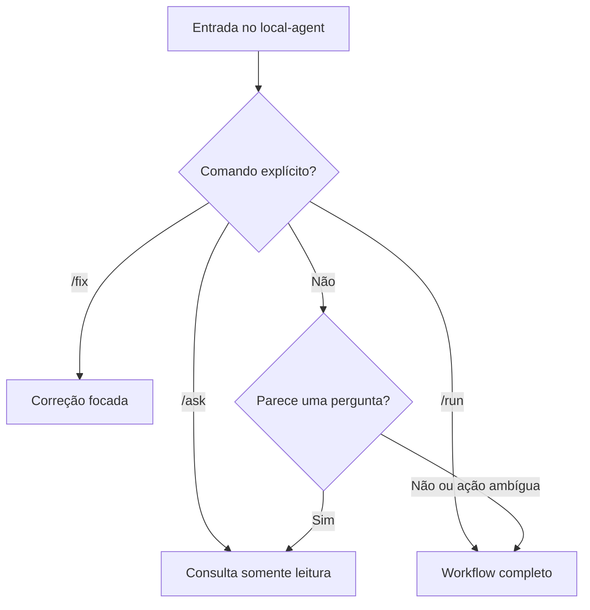
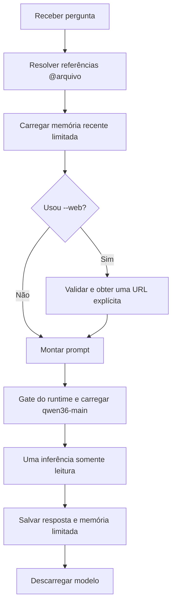
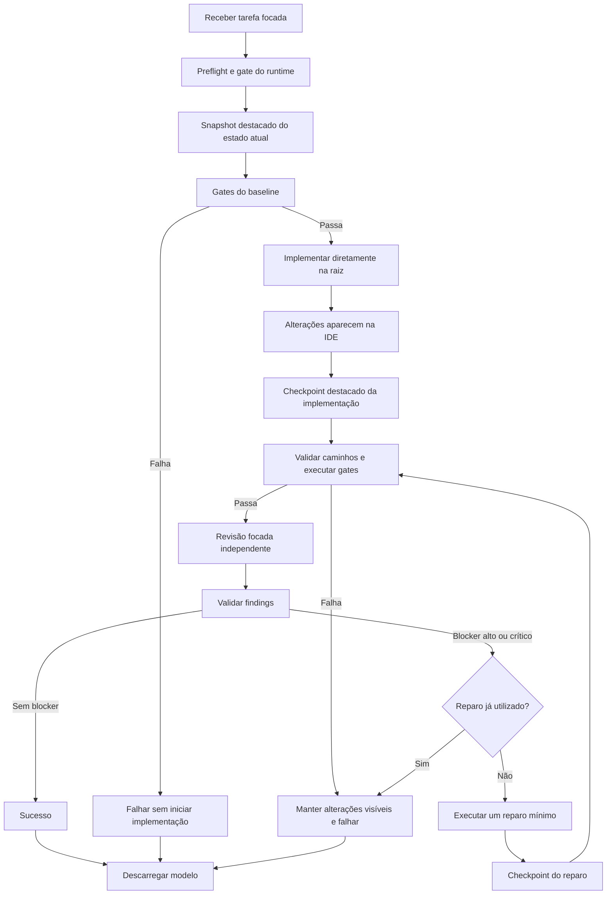
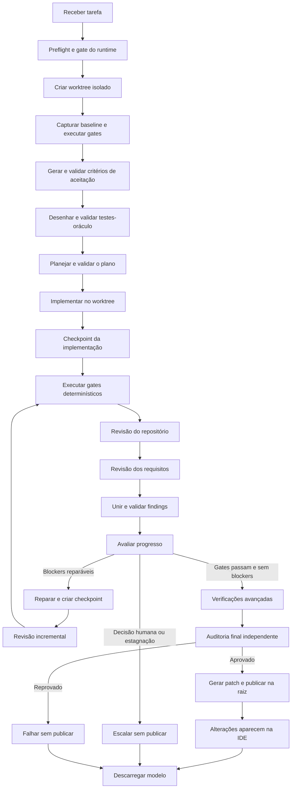
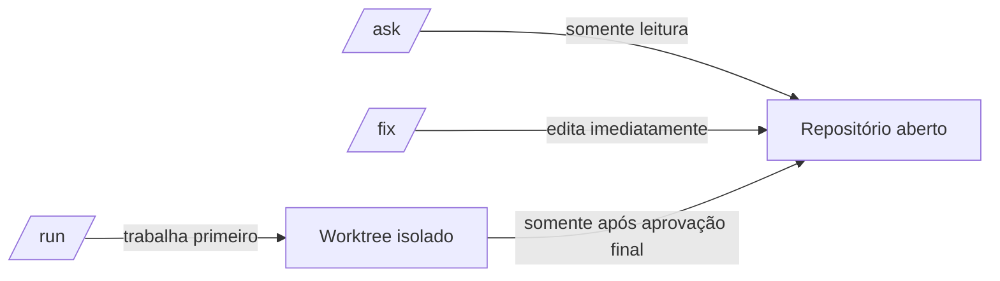
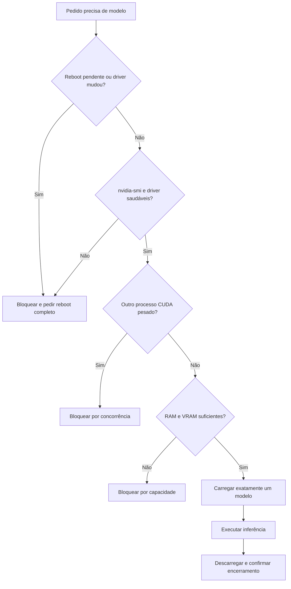

# Fluxos do Local Agent

Este documento resume o caminho executado por cada modo do `local-agent`. Os
diagramas descrevem o comportamento implementado atualmente.

## Escolha do fluxo

O roteamento automático nunca escolhe `/fix`. Uma mutação focada exige o
comando explícito; pedidos de ação comuns seguem o caminho mais conservador do
`/run`.

## `/ask`: pergunta rápida

Características:

- não permite `write`, `edit`, `bash`, subtarefas ou web implícita;
- lê arquivos somente quando referenciados por `@`;
- acessa a web somente com `/ask --web` e uma URL explícita;
- não cria workflow de engenharia nem altera o repositório.

## `/fix`: correção pequena e localizada

O `/fix` trabalha diretamente na raiz aberta pela IDE. Seus checkpoints usam
um índice Git temporário: não adicionam arquivos ao index do usuário, não movem
`HEAD`, não criam commit na branch atual e não fazem merge automático.

## `/run`: workflow completo e auditado

As verificações avançadas cobrem testes adversariais, property testing,
mutation testing e análise de flakiness. Uma capacidade não configurada é
registrada como `skipped`; nunca é presumida como executada.

## Onde os arquivos são alterados

| Entrada | Pode alterar arquivos | Local durante a execução | Visibilidade na IDE |
| --- | --- | --- | --- |
| `/ask` | Não | Raiz, somente leitura | Não altera |
| `/fix` | Sim | Raiz atual | Imediata |
| `/run` | Sim | Worktree isolado | Após sucesso e publicação |
| Pergunta em texto comum | Não | Mesmo fluxo de `/ask` | Não altera |
| Ação em texto comum | Sim | Mesmo fluxo de `/run` | Após sucesso e publicação |

## Gate operacional antes de usar a GPU

Esse gate representa a mitigação desejada para incidentes como atualização de
kernel ou driver NVIDIA durante uma sessão gráfica. O harness deve falhar antes
de carregar um modelo quando o driver estiver indisponível ou um reboot estiver
pendente. Isso reduz o risco, mas não substitui um desligamento completo após
uma GPU entrar em estado inválido e não impede falhas externas do kernel,
firmware ou hardware.

